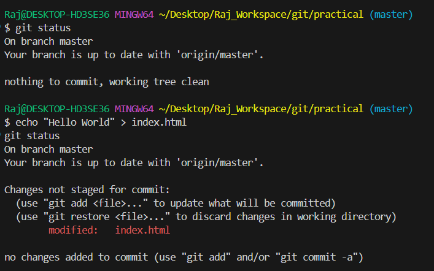

# 🚀 Git & GitHub DevOps Mastery

*The professional guide that developers actually enjoy using* 🎯

---

## 📋 Quick Navigation

| Icon | Topic                                            | Icon | Topic                                |
| ---- | ------------------------------------------------ | ---- | ------------------------------------ |
| 🏁   | [Initialize Repository](#-initialize-repository) | 📈   | [Check Status](#-check-status)       |
| ↩️   | [Restore Staged](#️-restore-staged)              | 🔄   | [Revert Commit](#-revert-commit)     |
| ⏪    | [Reset Commit](#-reset-commit)                   | 🔄   | [Pull vs Fetch](#-pull-vs-fetch)     |
| 📥   | [Clone Repository](#-clone-repository)           | 🔍   | [Compare Changes](#-compare-changes) |
| 🌿   | [Branch & Merge](#-branch--merge)                | ⚔️   | [Conflict Occur](#️-conflict-occur)  |
| 🤝   | [Conflict Resolved](#-conflict-resolved)         | 🎯   | [Skills Gained](#-skills-gained)     |

---

## 🏁 Initialize Repository

**Launch your project with proper version control from day one**

```bash
git init && git add .
git commit -m "feat: initial project setup"
git remote add origin https://github.com/user/repo.git
git push -u origin main
```

**📸 Screenshot:**  
*💡 Professional Tip: Use semantic commit messages for better project tracking*

---

## 📈 Check Status

**Keep your finger on the pulse of repository changes**

```bash
echo "<!DOCTYPE html><html><body>Welcome</body></html>" > index.html
git status
```

**Expected Output:**

```
Untracked files:
  index.html
```

**📸 Screenshot:** "screenshots/git-status.png"
*🔍 Status Guide: Know exactly what's changed, staged, or untracked*

---

## ↩️ Restore Staged

**Fix staging mistakes without losing your work**

```bash
git add file.txt              # Accidentally staged?
git restore --staged file.txt # No problem!
git status                   # Back to clean state
```

**📸 Screenshot:** `screenshots/restore-staged.png`
*🎯 Pro Use: Perfect for splitting large changes into focused commits*

---

## 🔄 Revert Commit

**Undo changes safely in team environments**

```bash
git log --oneline    # Review commit history
git revert a1b2c3d   # Create safe undo commit
git log --oneline    # Verify clean history
```

**📸 Screenshot:** `screenshots/revert-commit.png`
*✅ Team-Friendly: Preserves history while fixing mistakes*

---

## ⏪ Reset Commit

**Rewind time with precision and control**

```bash
git reset --hard HEAD~1   # ⚠️ Destructive: removes everything
git reset --soft HEAD~1   # 🛡️ Safe: keeps changes staged
```

**📸 Screenshot:** `screenshots/reset-commit.png`
*🚨 Critical: Never use hard reset on shared branches!*

---

## 🔄 Pull vs Fetch

**Choose the right sync strategy for your workflow**

```bash
# 🎯 Strategic Approach (Teams)
git fetch origin
git merge origin/main

# ⚡ Quick Approach (Solo)
git pull

# 🧹 Clean Approach (Linear History)
git pull --rebase
```

**📸 Screenshot:** `screenshots/pull-fetch.png`
*🏆 Recommended: Fetch + Merge for team collaboration*

---

## 📥 Clone Repository

**Get started with any project in seconds**

```bash
git clone https://github.com/user/project.git
cd project
git status
```

**📸 Screenshot:** `screenshots/clone-repo.png`
*🚀 Pro Tip: Use SSH URLs for faster, more secure authentication*

---

## 🔍 Compare Changes

**Become a code detective with powerful diff tools**

```bash
git diff                    # Unstaged changes
git diff --staged          # Staged changes
git diff HEAD origin/main  # Compare with remote
git diff feature main      # Branch differences
```

**📸 Screenshot:** `screenshots/git-diff.png`
*👀 Use Cases: Code reviews, debugging, change validation*

---

## 🌿 Branch & Merge

**Master professional feature development workflow**

```bash
# Create feature branch
git checkout -b feature-login

# Develop feature
echo "Authentication module" > login.html
git add . && git commit -m "feat: add login system"

# Merge to main
git checkout main
git merge feature-login
git branch -d feature-login
```

**📸 Screenshot:** `screenshots/branch-merge.png`
*🌊 Professional Practice: One feature per branch, clean merge history*

---

## ⚔️ Conflict Occur

**Understand when and why Git conflicts happen**

```bash
# Simulate a merge conflict
git checkout -b feature-header
echo "Header v1" > header.html
git add . && git commit -m "feat: add header v1"

git checkout main
echo "Header v2" > header.html
git add . && git commit -m "feat: update header v2"

# Now merge conflicting changes
git merge feature-header
```

**Expected Output:**

```
Auto-merging header.html
CONFLICT (content): Merge conflict in header.html
Automatic merge failed; fix conflicts and then commit the result.
```

**📸 Screenshot:** `screenshots/conflict-occur.png`
*⚠️ What Happened: Both branches modified the same file in overlapping lines.*

---

## 🤝 Conflict Resolved

**Turn merge chaos into collaboration success**

```bash
# Open conflicting file
# Resolve manually:
# <<<<<<< HEAD
# Header v2
# =======
# Header v1
# >>>>>>> feature-header

# Keep the correct version, then:
git add header.html
git commit -m "fix: resolve merge conflict in header.html"
```

**📸 Screenshot:** `screenshots/conflict-resolved.png`
*✅ Best Practice: Always discuss conflict resolutions with your teammate before finalizing.*

---

## 🎯 Skills Gained

### Core Competency Matrix

| Skill                | Proficiency | Real-World Impact               |
| -------------------- | ----------- | ------------------------------- |
| **Repository Setup** | 🏆 Expert   | Rapid project initialization    |
| **Change Tracking**  | 🏆 Expert   | Efficient daily workflow        |
| **Undo Operations**  | 🏆 Expert   | Risk-free mistake recovery      |
| **Branch Strategy**  | 🏆 Expert   | Seamless team collaboration     |
| **Remote Workflows** | 🏆 Expert   | Distributed development mastery |


## 📁 Documentation Structure

```
screenshots/
├── init-push.png          # Project initialization
├── git-status.png         # Change tracking
├── restore-staged.png     # Staging management
├── revert-commit.png      # Safe undo operations
├── reset-commit.png       # History management
├── pull-fetch.png         # Team synchronization
├── clone-repo.png         # Environment setup
├── git-diff.png           # Code comparison
├── branch-merge.png       # Feature development
├── conflict-occur.png     # Merge conflict simulation
└── conflict-resolved.png  # Conflict resolution demonstration
```

### 🎨 Professional Standards

* **Terminal**: Consistent dark theme (One Dark Pro)
* **Font**: 14pt monospace for readability
* **Layout**: Clear command → output flow
* **Focus**: Highlight key information

---

## 💡 Why This Guide Works

* ✅ **Practical Focus**: Commands you use every day
* ✅ **Visual Learning**: Screenshots provide instant validation
* ✅ **Risk Awareness**: Clear warnings for dangerous operations
* ✅ **Team Ready**: Workflows designed for collaboration
* ✅ **Professional**: Industry-standard practices

---

## 🏆 Career Impact

Mastering these Git skills prepares you for:

* **Senior Developer roles**
* **DevOps Engineering positions**
* **Technical Lead opportunities**
* **Open Source contributions**

---

## 🎯 Next Steps

**Immediate Actions:**

1. Practice each command in a sandbox repository
2. Create your own screenshot library
3. Implement these workflows in current projects

**Professional Growth:**

* Set up Git hooks for code quality
* Master advanced merge strategies
* Contribute to team Git standards
* Mentor junior developers

---

*"Good Git habits are the foundation of professional software development. This guide builds that foundation."*

